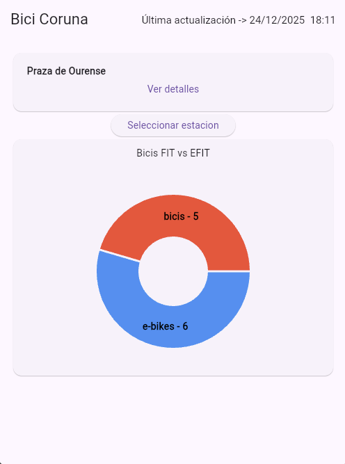
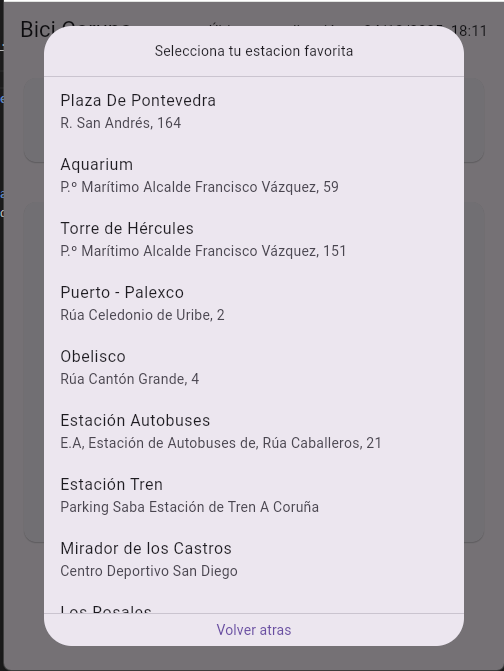
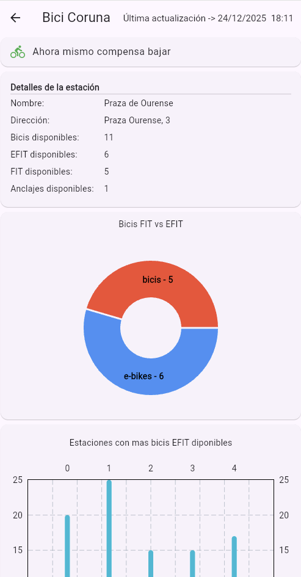
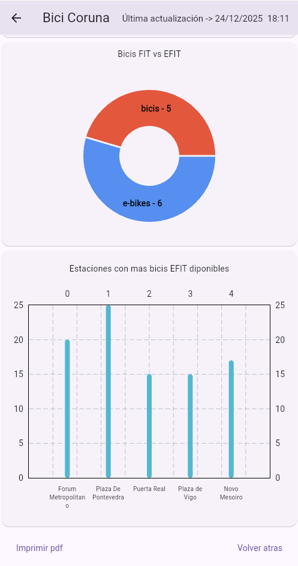
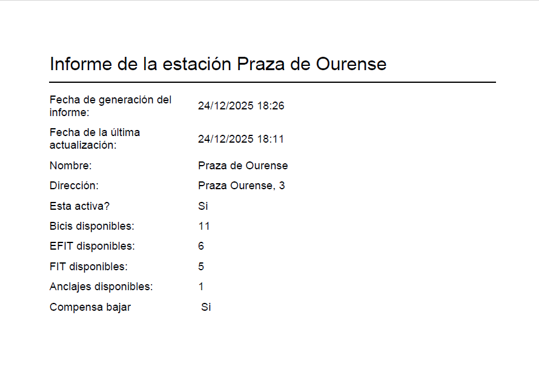

# bici_coruna
El objetivo de la aplicación es ofrecer a los usuario de BiciCoruna una aplicación que resulte mas ágil y práctica para consultar los datos de las estaciones de bici.

# capturas
  

# justificacion de las gráficas elegidas

Elegí la gráfica de bicis Fit vs Efit para  visualizar de una forma rápida y clara si esta disponible el tipo de bici que se busca.
La segunda gráfica muestra el top 5 estaciones con bicis disponibles, para tener una orientación sobre  en que estaciones es mas probable encontrar bicicletas disponibles con regularidad.

# dependencias usadas
 http,fl_chart, pdf,printing,cupertino_icons,provider,intl
